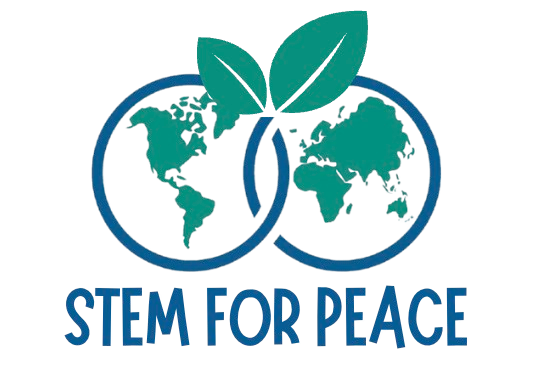

# UWC (United World College) STEM for Peace Summer Program is Launching this June!

📌 Since April 2023, many families have fled from Sudan to Egypt seeking peace. Due to the huge number, many students were forced to go illegally to Egypt, need to get refugee status in order to be recognised in the country and can only go to certain schools for refugees in Egypt. A major problem with these schools is that they are overloaded and they cannot take as many refugee students as there are, and many families cannot afford the very few necessities for their children to go to school. UWC STEM for Peace is a sustainable education project utilizing technology and science educational resources to tackle the problem from two sides. 

Our Program:

✅ 3-week bootcamp in sciences and mathematics

✅ Hardware: Building mini science lab in Africa Hope Learning Centre for experimental science learning

✅ Software: HopEd, a self-paced learning app based on relevant local curriculums to help students catch up with gaps in education; Summer Bootcamp + Short Courses during the term taught by on-site and online teachers from United World College

# Program Information

📅 Time: June (Date, Timing and Signup to be released in April)

📍 Location: Africa Hope Learning Centre (www.africanhopelc.org/) Corner of roads 107 and 159 (#18) Maadi, Cairo, Egypt. A 5 minute walk from the metro station Hadayak Al-Maadi, on the side of the Cornish. 

AHLC is located in a relatively small building that once housed a family of 8 in the greater Cairo area. Every possible space is utilized, with both morning and afternoon shifts, in order to accommodate the many students who have sought refuge in Egypt due to war, violence and persecution in their home countries. Due to overcrowding and prejudice in local schools, refugee children need alternate learning centres. AHLC is a safe place of learning for more than 450 refugee children, K-8, with at least 10 different African nations, including North and South Sudan, Eritrea and Ethiopia. It is here where students receive instruction in core subjects, character training, access to basic health care and are guaranteed a nutritious, hot meal each day.

🎯 Goals: Experimental and Theoretical STEM Skills Spanning Mathematics, Sciences

🎓 Outcome: Certificate of Program Learning, join STEM Fellows Mentorship Program for courses throughout the school year delivered by United World College students

# Curriculum
✨ Week 1: Bootcamp (intensive training) of foundational subjects in English and Mathematics.

🚀 Week 2: Science Experiment Exploration - Physics, Biology and Chemistry

👩‍🏫 Week 3: Applications of Sciences - Capstone Project

# Benefits of Program

This program will help students develop transferable understanding of concepts, practice skills important for specific disciplines in STEM, and start using what they have learned in real-life scenarios. Students can take these classes as part of their preparation for college and future career in STEM, no matter if their plan is going back to their country or studying in Egypt.

✅ Certificate of Completion

✅ Mentorship from Teachers and Students at United World College

✅ Higher Education Opportunities Guidance from University Gradutes, Medical Students, UWC Students

✅ Experience Inter-Cultural Exchange in Sciences

Unlike the traditional STEM classroom where students learn by reciting concepts and practicing sets and sets of problems, we will use the Concept-based Inquiry model in this program, and reflect constantly on classroom practices based on the Teaching for Robust Understanding (TRU) framework. We will identify important concepts and practices of specific STEM disciplines and design activities that invite students to learn these important ideas. 

# Enrollment from April 20 - May 1st, 2025
📌 Admission Criteria: Spots for 50 Students with Passion and Commitment to Learning!

📅 Announcement of Results: 10/5/2025

💰 Cost: Completely Free Program, Covering Lunch, Transport, Learning Materials

# Contact

📩 Contact us through the WhatsApp Group Chat to learn more!
